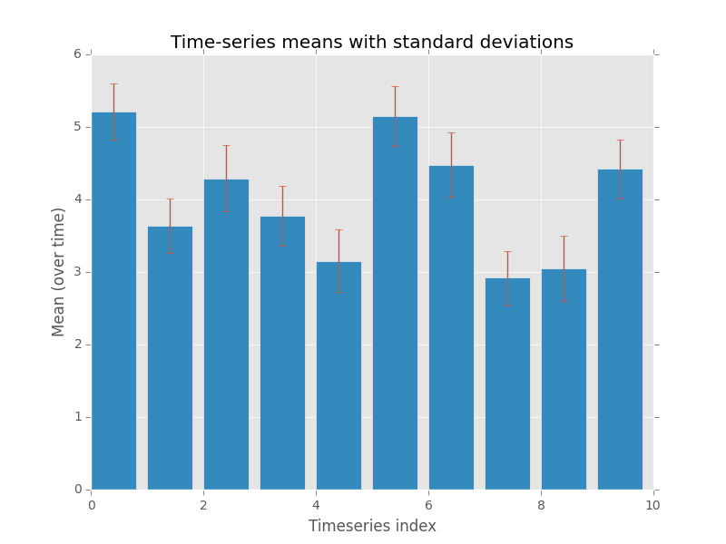

[](http://xkcd.com/353/)

Welcome!

This tutorial contains the following pages: 

<li>
    <a href="{{ page.url }}">{{ page.title }}</a>
    <p>{{ page.short-description }}</p>
</li>


## Introduction

These notes are intended as a light introduction and guide
to learning how to program in Python.

As big a part of this workshop as any of the formal aims listed below, 
is that you should enjoy yourself. Python is a fun language because it is
relatively easy to read and tells you all about what you did wrong (or what 
module was broken) if an error occurs.

With that in mind, have fun, and happy learning!

## Structure of this course

The main components of this workshop are these notes and accompanying 
exercises. 

In addition you will receive a brief introductory talk, and we 
will work through the first exercise together to make sure that you are 
able to write and run a basic Python script. 

From there, you'll be left to work through the material at your own pace
with invaluable guidance and advice available from the workshop demonstrators. 

Where appropriate, key points will be emphasized via short interjections 
during the workshop. 


## What is Python?

Python is the name of a programming language (created by Dutch 
programmer [Guido Van Rossum](https://en.wikipedia.org/wiki/Guido_van_Rossum)
as a hobby programming project!), as well as the program, known as 
an interpreter, that executes scripts (text files) written in that language. 

Van Rossum named his new programming language after Monty Python's Flying Circus 
(he was reading the published scripts from "Monty Python’s Flying Circus" at the 
time of developing Python!). 

It is common to use Monty Python references in example code. 
For example, the dummy (aka metasyntactic) variables often used in Python 
literature are spam and eggs, instead of the traditional foo and bar.
As well as this, the official Python documentation often contains various 
obscure Monty Python references.


> **Jargon**
> 
> The program is known as an interpreter because it interprets 
> human readable code into computer readable code and executes it. 
> This is in contrast to *compiled* programming languages like C, C++, 
> and Java which split this process up into a compile step (conversion of 
> human-readable code into computer code) and a separate execution step, which 
> is what happens when you press on a typical program executable, or run a 
> Java class file using the Java Virtual Machine. 

Because of it's focus on code readability and highly expressive syntax 
(meaning that programmers can write less code than would be required with 
languages like C or Java), Python has grown hugely in popularity and 
is now one of the most popular programming languages in use. 


## Why Python? : Motivation

Now that we know roughly what Python is, why is Python of interest to 
us as researchers? 

For users of specialist packages like Matlab, Stata, R, the answer
might be because Python offers in most cases a similar performance 
and range of functions, 
while providing a much wider range of additional functionality. Plus
compared with Matlab or Stata, Python is open-source and free. 

If you come from a low(or lower)-level computing background like C++, 
Java, Fortran, then Python is great at accelerating development and 
prototyping time, and the ability to "glue" together routines written 
in Fortan or C++ offer the best of both worlds. 

Lastly, if you're not from either of these backgrounds, then let's 
provide a sample of what you can do with Python for a 
typical research project: 

* A huge number of libraries means that data readers and writers 
  have been written for a wide range of data formats. 
* Once data is loaded, numerical analysis libraries allow 
  statistical analysis and modelling to be performed
* The resulting analyses can be turned into plots using Matplotlib
  or one of a growing number of alternative plotting libraries. These
  plots can generally be saved as images (PNG, JPG) or PDFs. 
* The above process is trivial to perform in batch over whole directory
  trees
* User interface and web application libraries mean that instead of running
  command line scripts, you can develop rich graphical interfaces for your 
  collaborators, including web-pages. 


**Example: with just 13 lines of Python (plus comments), we are able to write 
a realistic script to 
loop over all CSV files in a folder (and subfolders), and 
generate a statistical plot for each one, including titles etc!**



("Time-series" generated using `numpy`s random number generator).  




**Note: lines starting with a hash (#) are just comments - 
text useful for other developer and is not executed**

In code: 

```py
# Modules we're going to use
import os, numpy, pylab
# Matplotlib's default style is a bit ugly, use the R's
# ggplot2-inspired style!
pylab.style.use('ggplot')

# "Walk" through the entire directory tree
for root, dirs, filenames in os.walk("/datapath"):
    # Work on csv (comma separated value) files 
    for filename in filter(lambda f: endswith(".csv", filenames)):
        # Load 2d time-series data into an array using Numpy
        # (time is along 2nd dimension)
        data = numpy.loadtxt(filename, delimiter=",")
        # Get some stats
        means   = data.mean(axis=-1)
        stdevs  = data.std(axis=-1)
        stderrs = stdevs / numpy.sqrt(data.shape[-1])

        # Make bar plots with errorbars
        pylab.bar(range(data.shape[0]), means, yerr=stderrs)
        
        # Add in labels and title
        pylab.xlabel("Timeseries index")
        pylab.ylabel("Mean (over time)")
        pylab.title("Time-series means with standard deviations")

        # Save the plot as a PDF
        # in the data folder with a datafile specific filename
        pylab.savefig(os.path.join(root, filename + "_result.pdf"))
```



In addition, this was using general numerical libraries; with a specialist 
library like **Pandas** this could probably have been reduced further.

While these modules won't be covered until the advanced sessions, 
these introductory sessions lay the groundwork for being able to 
use these modules. 

## Aims

This course aims to teach you how to use basic Python including 

* Writing scripts
* Python variable types
* Control flow (``if``, ``for``, ``while``)
* Reading and writing files
* Functions (using and writing!)
* Commenting and documenting code
* Working with modules

We will not be delivering hours of lectures on programming constructs and
theory, or detailing how every function of every module works. 

<div class="important-section">
Instead the aim of this workshop is to provide an environment for **you** 
to learn to program, with help at hand when you need it, and some introductory 
exercises and notes to help you get started. 
</div>

### Printing the notes

For both environmental reasons and to ensure that you have the most 
up-to-date version, we recommend that you work from the online version of
these notes.

However, if you wish to have a hard copy, you may download a pdf version
of the notes from here : [python_2016___introduction_to_python.pdf](/python_2016___introduction_to_python.pdf) and print them.

### Errata

Please email any typos, mistakes, broken links or other suggestions to
<j.metz@exeter.ac.uk>.

### Installing on your own machine


If you want to use Python on your own computer I would recommend using
one of the following "distributions" of Python, rather than just the 
basic Python interpreter. 

Amongst other things, these distributions take the pain out of getting 
started because they include all modules you're likely to need to get started
as well as links to pre-configured consoles that make running Python a breeze.  

* [Anaconda (Win, MacOS, Linux)](https://www.continuum.io/downloads) : Commercially backed free distribution
* [WinPython (Windows Only)](https://winpython.github.io/) : Open-source free distribution
* Linux : Python 2 is pre-installed on most linux distributions; to install Python 3, simply use your favourite package manager. E.g. on Debian based systems (Debian, Ubuntu, Mint), running `sudo apt-get install python3` from a terminal will install Python 3. Alternatively use Anaconda.

**Note** : Be sure to download the Python **3**, not 2, and get the correct architecture for your machine (i.e. 32 or 64 bit). 
