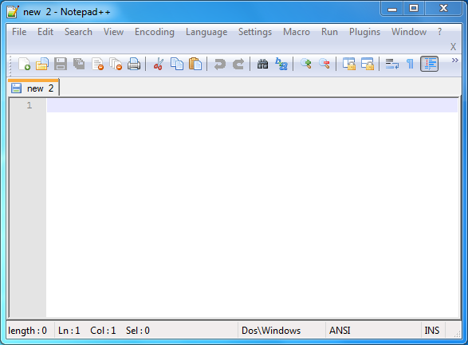
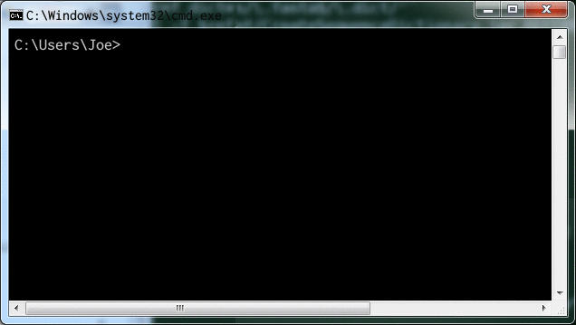
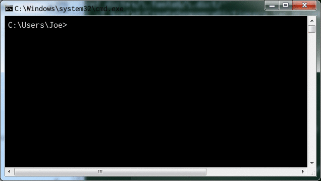
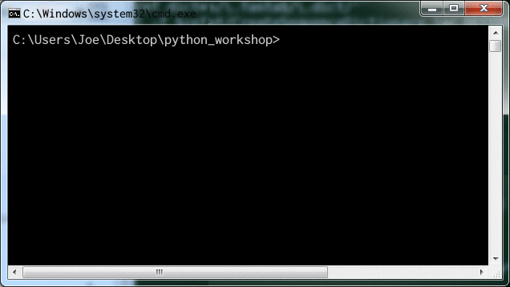

# Writing your first Script

## Organization of scripts

Before we write anything, let's create a folder to hold your Python scripts. 

Usually you would choose a hierarchy that's sensible for you 
(for example I use `Documents/programming/python` in my home directory 
as the root for all of my Python projects!). 

For the purposes of this workshop, let's use your Desktop folder
**in your U drive** and create a folder called 
```
python_workshop 
```

## What is a Python Script?

A Python script is just a plain text file, and the 
convention is to use the extension `.py` (instead of e.g. `.txt`) 
to let programs know that it holds Python code.

> Python code is very close to something called pseudo-code, which 
> is what people use when detailing the main components of an algorithm. 
> 
> For example, the pseudo-code for the factorial function 
> (e.g. 3! = 3 x 2 x 1):
>
> ```
> SET fact to n
> WHILE n is more than 1
>     SET fact to fact times (n - 1)
>     SET n to n - 1
> ```
> 
> while the python code is
>
> ```python
> fact = n
> while n > 1:
>     fact = fact * (n-1)
>     n    = n - 1
> ```
> 
> What this simple example illustrates, is that Python is extremely 
> readable; it just takes becoming familiar with a few base syntax rules (~grammar). 
> 
> We'll be speaking Python in no time!

## Worked Exercise : Hello, world!

We'll start by creating a blank Python script file. 

### Creating a file 

We're going to name our first script file 
`exercise_hello_world.py` and keep it inside the newly created `python_workshop` 
folder. 


To do this, open `Notepad++`. You should see a blank file (that may be named "new 1", or "new 2" etc, depending on if you closed any tabs!). 



If you don't see a blank file, select `File->New` in from the menu bar. 

Then select `File->Save As`, navigate to the `python_workshop` 
folder we created a few minutes ago, 
and set the file name to `exercise_hello_world.py` and click **Save**. 

Now that we have a blank Python script file, lets start adding 
some code!


### Initial content 

First of all, enter: 

```py
# Author: Your Name <your@email.address>
# This is a script to test that Python is working
```

replacing the text in the line starting `# Author` with your details. 

### Running the script with Python: The Terminal 

Now let's see what running this through Python does!

Start a customized command prompt (**reminder**: in the Windows
File Explorer, find the WinPython3 folder on the C: drive, 
and click on  **WinPython Command Prompt.exe**). 

A terminal window should pop up, that looks a little bit like 



> **Reminder: Basic terminal usage**
>
> You were advised to have basic knowledge of using a terminal 
> (Windows Command Prompt/Linux Terminal/MacOS Terminal), 
> you're about to see why! 
> 
> Here's a recap of the things you're most likely to need.
> 
> <table>
>   <tr>
>       <th>Windows</th>
>       <th>MacOS / Linux</th>
>       <th>What it does</th>
>   </tr>
>   <tr>
>       <td><code>cd FOLDER_NAME</code></td>
>       <td><code>cd FOLDER_NAME</code></td>
>       <td>Change directory to FOLDER_NAME </td>
>   </tr>
>   <tr>
>       <td><code>dir [FOLDER_NAME]</code></td>
>       <td><code>ls [FOLDER_NAME]</code></td>
>       <td>List folder contents; if FOLDER_NAME<br>is omitted, list current folder contents</td>
>   </tr>
>   <tr>
>       <td><code>..</code></td>
>       <td><code>..</code></td>
>       <td>Reference to parent folder. E.g. <code>cd ..</code><br>is how you would navigate from <code>/a/b/c/</code> to <code>/a/b/</code><br>(if you are currently in <code>/a/b/c/</code>).</td>
>   </tr>
>   <tr>
>       <td><code>mkdir FOLDER_NAME</code></td>
>       <td><code>mkdir FOLDER_NAME</code></td>
>       <td>Create a folder called FOLDER_NAME</td>
>   </tr>
> </table>


> **Quick note on terminology**
> 
> **Folder** and **directory** refer to the same thing, while 
> **full path** or **absolute path** means the full directory 
> location. E.g. if you're currently in your Desktop folder, the folder is 
> Desktop, but the full path is something like <code>/users/joe/Desktop</code>. 
> If you're on Windows the path starts with a drive letter too, like 
> <code>C:</code> or <code>U:</code>, and the forward-slashes will be backslashes instead. 
> 
> **Console** and **terminal** (and sometimes **shell**) are usually 
> used interchangeably to mean 
> the same thing; the text-based interface where commands can be entered. 
> In windows, the built-in console is also called the "command prompt" 
> and is started using <code>cmd.exe</code>. 
> 
> For our purposes, we're going to be mainly interested in the terminal console 
> which is where we type commands like `cd`, or `dir`.
> 
> For interactive Python snippet testing we can also use the 
> Interactive Python console, which is where we can directly type 
> python commands. You might encounter this later; for now just be 
> aware that there are these two types of console. 

Now using the terminal command to change directory, `cd`, navigate to 
your Desktop directory. 



You can verify that it contains your new `python_workshop` folder by 
using the **windows** terminal command `dir`:

```shell
dir
```
should list 
```
python_workshop
```
in the output. 


Change directory into the `python_workshop` folder using

```shell
cd python_workshop
```
and verify that our new file is there using `dir`.

If you see your file (**exercise_hello_world.py**) listed, great! If not, 
check the previous steps carefully and/or ask a demonstrator for help. 

Once the terminal is in the correct directory, we're ready to run Python on 
our file. 

As the terminal is preconfigured (meaning that it knows all about the Python program and where to find it) we can simply type `python ...` to run the Python interpreter, replacing "..." with input arguments. 

In most simple use cases, we just use a single input argument; the script file name.

> In advanced usage cases, we can also add in additional **command line 
> arguments** to the script, but this will be covered in an advanced exercise 
> in the follow-on workshop.

We can now type 

```shell
python exercise_hello_world.py
```

to get Python to run our script file: 




We should get no output - python has interpreted and run our script file, 
but as the script only contained **comments**, no terminal output was 
produced!

> **Comments**
> 
> Comments are used to make notes about things like 
> what each few lines of code are doing. 
> In our case, we also added an initial comment that 
> keeps track of who wrote the script. 
> Comments are created by using the hash symbol, **#**. 
> 
> A comment can take up a whole line as in our script above, 
> or only part of a line; we'll see an example of this later. 

### Adding functionality  


Now that we have a script file that contains a couple of lines of 
comment, and successfully runs with Python (i.e. does nothing!), let's 
add some functionality.

Switch back to the editor window (Notepad++) and add an empty line 
(for readability). 
Then, on the fourth line of the script add the text 

```py
print("Hello world from YOURNAME")
```

replacing the placeholder YOURNAME with your actual name. 


<tutorial-page-exercise 
    dlgid="answer-hello-world" url="content/python2016_intro/exercises/answer_hello_world.md" 
    buttontext="Full code listing" buttoncolor="green">
</tutorial-page-exercise>

Switch to the terminal window, and repeat the python command 

> **Tip**
> 
> On many terminals, you can press the Up arrow key to cycle through 
> previous commands. This will save you from having to type 
> the command each time!

> **Tip**
> 
> On several desktop environments (including Windows), you can 
> cycle between open windows using "Alt + Tab" (or "Alt + Shift + Tab) 
> to cycle in the other direction); this saves you from having to 
> use the mouse between editing and running code. 


Hurrah! We got Python to output text to the terminal. 
This may not seem like much of an achievement, but once you understand 
this line of code, you're well on your way to being able to program 
in Python. 


So let's have a look. 

### Anatomy of our script


#### Lines 1 & 2

As mentioned above, lines 1 and 2 are comments, which are non-executing 
lines of text that are used for us to be able to understand our code. 
They may seem pointless now, but if you give your script to a colleague 
who's never touched a program before, if they read the first couple of 
lines they will immediately know who wrote the script, and why. 

Comments become much more useful as scripts grow; future you 
may well benefit from well commented code as you look back over a script 
and try to remember what you were doing and why!


#### Line 4

Our first line of Python code contains two of the 
major concepts of this course; a **function call**, and **data type**. 

### Calling a function 

The function being called, or executed, is named `print`, and 
the data it is given as an _argument_ is `"Hello, world from Joe"`.
This data is of _type_ **string** (more on ths in the next setion!).

> #### What is a Function?
> 
> A function is a self-contained piece of processing; often functions take inputs and 
> provide return values (but they don't have to). 
> 
> They provide a way to separate specific pieces of processing so that they can be 
> reused over and over again. 
> 
> If you're familiar with the concept of a function from mathematics, 
> programming functions can be similar: for example the **sin** 
> trigonometric function generates an _output_ 
> number (between -1 and 1) for any _input_ angle. 
> 
> The `print` function does not generate any output values - it only causes it's 
> input to be "printed" to the terminal. For functions that _do_ generate output 
> values, these outputs are often captured by _assigning_ them to _variables_ - more on this later!


The syntax for calling a function is: 
* the function name, in this case `print`,
* followed by open parentheses, **(**
* the argument list, in this case the string `"Hello, world from Joe"`, 
* and then close parentheses, **)**


### Outputting to the terminal using `print`

The `print` function is useful for providing output to the terminal - which is 
the most basic way of getting information out of a Python script.

The print function accepts a variety of input data types. For example we can 
write 
```py
print("Any string") 
```
as well as
```py
print(3.147)
```
i.e. a number. 

You may also pass multiple, comma-separated arguments to the `print` function. 
E.g. 

```py
print(10, "is bigger than", 2)
```
outputs:
```
10 is bigger than 2
```

Now that we know how to write a script, and how to run it with Python, let's 
examine in more detail what goes into the script, starting with data types. 

### VITAL note on whitespace in Python scripts

The creator of Python decided that code-readability is crucial for good programming, 
and that unlike almost all other languages where badly laid out code is still valid, 
in Python code **must** be laid out in a specific way. 

By layout, we're refering to the whitespace (spaces or tabs) preceding text in code, 
known as the **indentation**: 

<div class="important-section">
**Every "logical block" of code in Python must be at the same indentation level**. 
</div>

For example 

```py
print("Hello")
print("World")
```

is perfectly fine, while 

```py
print("Hello")
  print("World")
```

would cause an indentation error.  

While this feature of Python may seem petty or just irritating at first, many 
Python users grow to appreciate its significance in enforcing good coding practice. 

