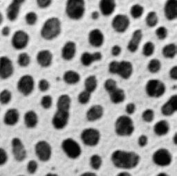
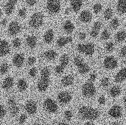
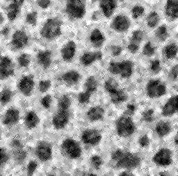

# Basic image cleanup with ImageJ

## Theory

Noise is sometimes spatially uncorrelated, meaning that the noise at pixel location x,y is independent of the noise at location x+1,y.

We can take advantage of this fact to “smooth out” this type of noise in images, by use of relatively simple filtering operations. Median filtering can be viewed as a majority-voting operation; if most pixels in the filter window region are dim (of low intensity), then the median value will be low. Conversely , if most pixels are bright (high intensity) then the median value will be high.

This means that median filtering removes pixel-to-pixel variation and replaces each pixel by the median of the pixels in that pixels neighbourhood.

## Steps
In order to “clean” an image of noise and other artefacts, we can use the median filter operation included in ImageJ.

The steps involved in reducing noise are summarized below;

* File->Open [open your dataset]
* Process->Filters->Median
* Select a radius >= 1 but smaller than any feature you need to be able to see /detect
* Press “Ok”

> Tip:You can check the preview box to get live feedback on your choice of radius.

## Example

If we take the original Blobs sample data set

original_blobs

and add a lot of noise (standard deviation = 100)

noisy_blobs

we see that this image would be very difficult to analyse as is (e.g. applying a threshold now would produce a very inaccurate segmentation).

By applying  a median filter we recover, to some extent, the underlying pattern;

denoised_blobs

